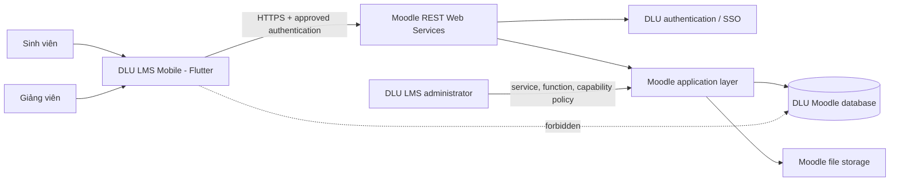
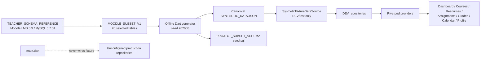
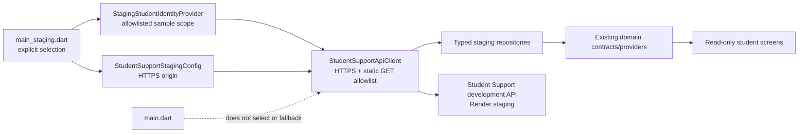
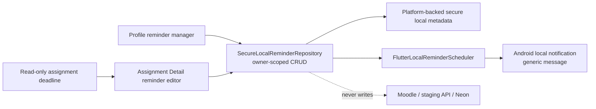
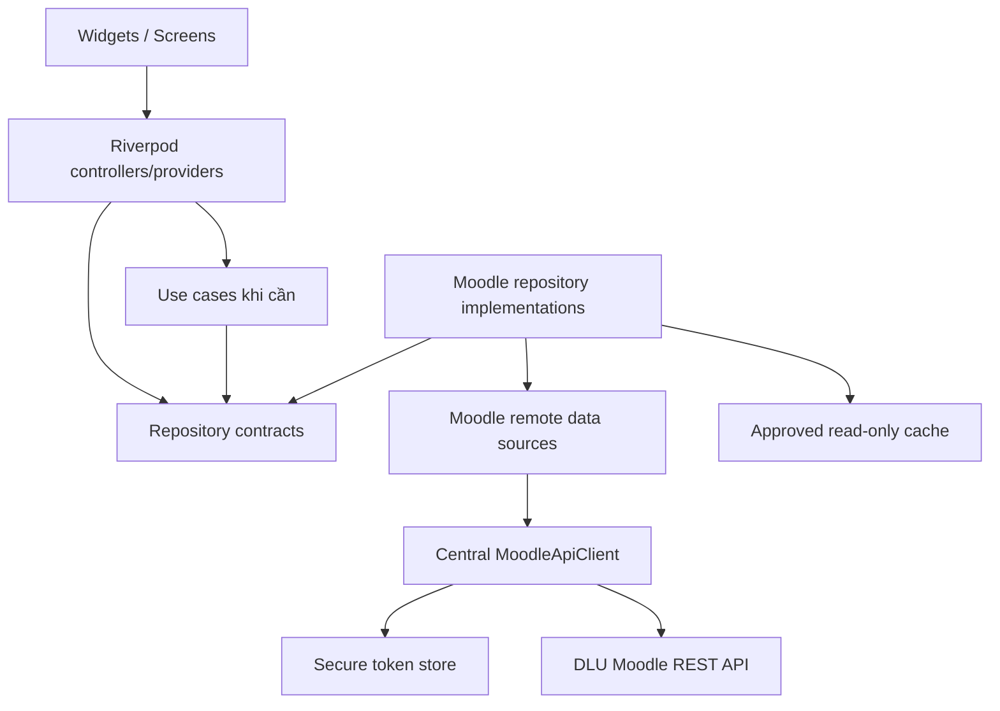
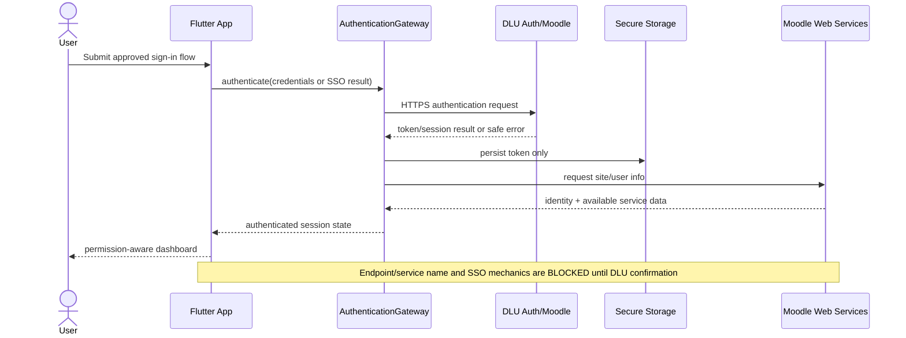
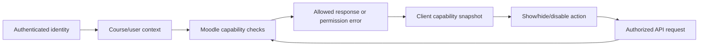
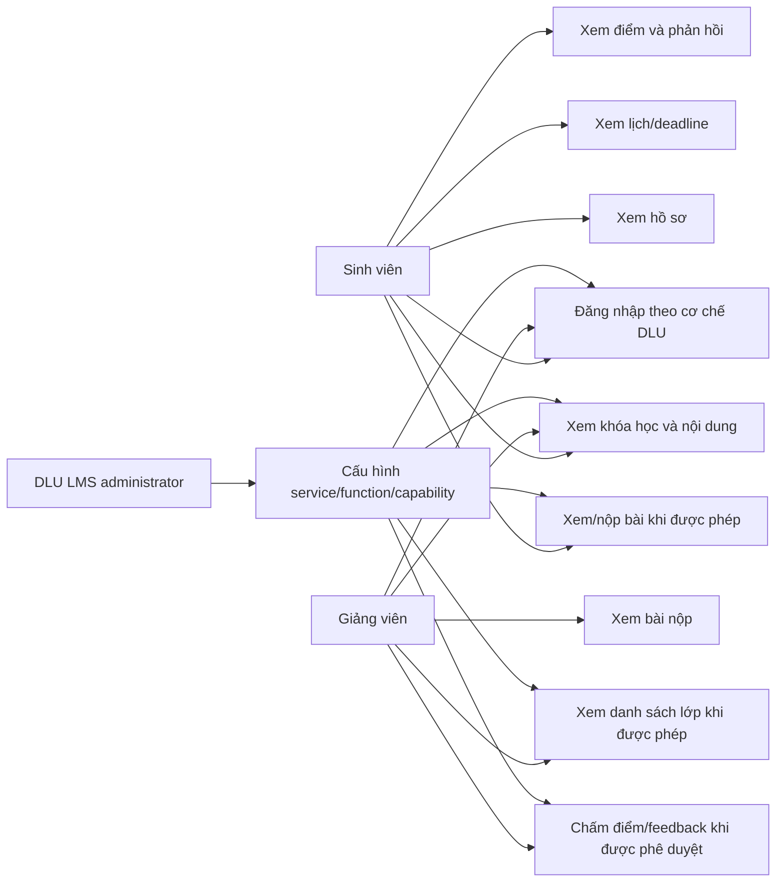
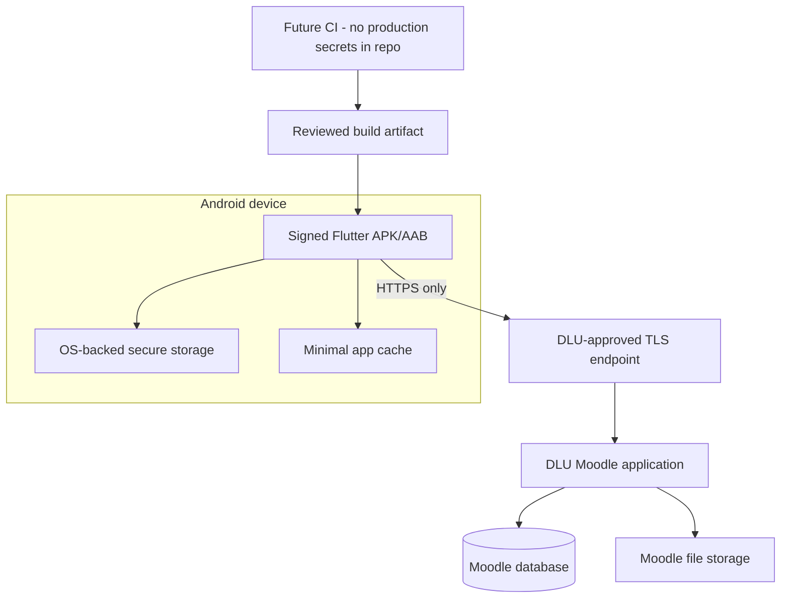

# Architecture

## Current deployed boundary — 19/09/2026

Student staging: Flutter → HTTPS Render → Node/Fastify read API → Neon `lms`
(22 tables/10 views). Teacher: explicitly selected read-only canonical fixture
adapter, not a Teacher endpoint. Local reminders are app-owned device metadata.
The group's 3-schema/39-table report is a separate input, not deployed reality;
see `REPORT_ALIGNMENT_NOTES.md`. No Spring backend, seed import or remote changes
were introduced during this alignment. Production still requires DLU-approved
auth/integration and never falls back to these development sources.

**Loại:** Implemented foundation + target architecture

**Implementation status:** Phase 2 foundation đã được triển khai. The separate
read-only Student Support staging composition root has a verified baseline; its
current local extension passes analysis and automated tests but remains pending
the combined APK/emulator gate. Các module Moodle live và phần được gắn
`BLOCKED`/`PROPOSED` vẫn chưa phải chức năng production hoàn chỉnh.

**Cập nhật:** 2026-09-18

## 1. Architecture goals

Thứ tự ưu tiên quyết định: security, correctness, Moodle compatibility, maintainability, testability, UX, performance, development speed.

Thiết kế phải:

- cho phép thay đổi cơ chế authentication sau khi DLU xác nhận token login hoặc SSO;
- dùng Moodle REST Web Services và Moodle capability enforcement thay vì truy cập database trực tiếp;
- tách API DTO khỏi domain model và presentation state;
- tách mock/dev data khỏi production repository;
- giữ cấu trúc đủ rõ để sinh viên giải thích trước hội đồng, không over-engineering;
- hỗ trợ loading/empty/error/retry nhất quán;
- cho phép bổ sung local cache read-only mà không làm thay đổi source of truth về quyền.

## 2. Conditional target system context



Flutter không kết nối trực tiếp database. Database access chỉ dành cho phân tích read-only hoặc server-side work được DLU phê duyệt.

Diagram trên là target sau khi DLU enable/approve Web Services. Hiện tại `NET-TOKEN-001/002` trả `enablewsdescription`, nên runtime production vẫn dừng tại fail-closed configuration boundary; không có đường Flutter → Moodle REST đang hoạt động.

## 3. Implemented Flutter structure

```text
lib/
  app/
    app.dart
    router/
    theme/
  core/
    config/
    errors/
    external_links/
    network/
    storage/
    widgets/
  dev/
    fixtures/
    student_support_api/
  features/
    assignments/
    auth/
      domain/
      presentation/
    calendar/
    dashboard/
    courses/
    grades/
    profile/
    progress/
    reminders/
    splash/
  main.dart
  main_development.dart
  main_staging.dart
test/
  core/
  features/
  app/
```

Hiện đã triển khai `auth`, `dashboard`, `courses`, `assignments`, `grades`, `calendar`, `profile`, `progress`, `reminders`, `splash`, core config/errors/network/storage/widgets và dev fixture boundary. Student data screens dùng một canonical generated fixture; production adapters tương ứng vẫn fail closed.

### Product presentation and navigation

Primary navigation của Student Support staging có năm destination tập trung:

```text
Splash → Login → App shell
                   ├── Trang chủ
                   ├── Khóa học → Course Detail → Assignment / Grades
                   ├── Bài tập → Assignment Detail
                   ├── Tiến độ
                   └── Hồ sơ → Giao diện / Nhắc việc học tập / Đăng xuất

Dashboard ──→ Lịch học tập (route theo ngữ cảnh)
Assignment Detail ──→ Tạo/chỉnh sửa nhắc việc cục bộ
```

- `AppShell` dùng Material 3 `NavigationBar` trên phone và chuyển sang `NavigationRail` từ breakpoint 720 px; rail mở rộng từ 980 px.
- Course Detail, Assignment Detail, Grades và Calendar là route theo context khi
  phù hợp. Bài tập và Tiến độ là primary destination riêng; route Assignment
  Detail kiểm tra `courseId` khớp assignment trước khi hiển thị.
- `AppTokens` tập trung spacing, radius, content width và breakpoint; `SectionHeader`/`ContentSkeleton` là primitive dùng chung để giữ hierarchy/loading state đồng nhất.
- `appThemeModeProvider` quản lý lựa chọn `Hệ thống`/`Sáng`/`Tối` cục bộ trong vòng đời app. Chưa đồng bộ setting này lên backend và không giả vờ đã persistence cross-device.
- Reminder Manager là route theo ngữ cảnh từ Hồ sơ. Assignment Detail chỉ mở
  editor nhắc việc cho deadline còn trong tương lai; reminder là setting cục bộ
  của người học, không phải event hay notification được ghi vào Moodle.
- Error state presentation đi qua `userMessageFor`; raw blocker code, endpoint, token, repository, schema, response body và exception không được render cho người dùng.
- Mọi data screen giữ loading/empty/error/retry contract phù hợp. Skeleton mô phỏng đúng cấu trúc nội dung thay vì một spinner toàn trang chung.
- Presentation không hiển thị nhãn fixture. Việc app chạy `main_development.dart` được quyết định ở composition root, không phải bằng banner/copy trong UI.

### Teacher schema and synthetic-data boundary



- `moodleschema.zoola.io` là schema tham khảo do GVHD chỉ định, không phải bằng chứng database production DLU.
- SQL/JSON chỉ chứa dữ liệu AI-generated synthetic; không có tài khoản, mã sinh viên, email hay điểm thật.
- Flutter không đọc SQL. `SyntheticFixtureDataSource` tải JSON asset rồi repository ánh xạ sang domain model.
- `main_development.dart` là composition root duy nhất inject fixture repositories; `main.dart` không import hoặc fallback sang chúng.
- Quan hệ đa hình/không có FK vật lý trên nguồn, ví dụ `course_modules.instance`, được ghi là `LOCAL_SYNTHETIC_CONVENTION` trong fixture và không được nâng thành live API contract.

### Explicit Student Support staging boundary



- `main_staging.dart` is intentionally separate from production and fixture roots.
  `StagingStudentIdentityProvider` first restores an allowlisted sample scope and
  the staging repository then resolves a read-only profile. The stored value is
  only a non-secret sample code, not a DLU password, token or credential.
- A staging 401 invalidates that local sample scope; `AuthController` returns to
  the selector through the usual unauthenticated router state. This is local
  development hygiene, not production session semantics or server authorization.
- `StudentSupportApiClient` accepts only the documented HTTPS origin and 11 GET
  contract paths. It sends no Moodle token, database secret, arbitrary query or
  write request.
- This boundary is development/staging-only. `STAGING_FLUTTER_CONSUMER_GATE=PASS`:
  `dart format .`, `flutter analyze` and `flutter test` (93 tests) passed, and the
  Android emulator verified Dashboard, Courses, Course Detail, Resource Detail,
  Assignment Detail, Grades, Calendar and Profile. It does not change the target
  production architecture in section 2 or add DLU authentication/write support.
- `OfficialLmsLauncher` is a separate safe handoff boundary for the Assignment
  Detail. It opens only the exact canonical HTTPS LMS origin through the platform
  external application. It never constructs activity links from sample IDs and
  does not turn the mobile app into a Moodle submission surface.

### App-owned local reminder boundary



- `LearningReminder` keeps only opaque owner/course/assignment references, due
  and reminder timestamps, enabled state and audit timestamps. It deliberately
  excludes academic text, grades, feedback, submission/file data, tokens and
  passwords.
- `SecureLocalReminderRepository` requires the active owner for every list,
  create, update, enable/disable and delete operation. Owner/course/assignment
  references are immutable after creation; duplicate and invalid/past schedules
  fail safely. Scheduling is coordinated with persistence so a failed local write
  attempts to restore the previous scheduler state.
- `FlutterLocalReminderScheduler` requests Android notification permission only
  when the learner enables a reminder and schedules a generic device-local
  message. It does not promise Moodle delivery, copy academic data into a
  notification, or issue a network request. Device delivery remains a manual
  emulator/device verification item.

## 4. Layer responsibilities

| Layer | Trách nhiệm | Không được làm |
|---|---|---|
| Presentation | Widget, navigation, state, loading/empty/error/retry, capability-aware controls | Parse raw JSON, lưu token, quyết định authorization cuối cùng |
| Domain | Entity/value object, repository contract, use-case logic có giá trị | Phụ thuộc Flutter widget hoặc Dio response |
| Data | Moodle DTO, mapper, remote/local data source, repository implementation | Đưa token vào log, silently fallback sang mock |
| Core | Config, HTTP client, error mapping, secure storage, common UI primitives | Chứa business logic feature-specific |
| Moodle/server | Authentication, validation, capability/context enforcement, business rules | Tin tưởng role/boolean do client gửi |

Mỗi feature không bắt buộc đủ cả ba layer nếu logic đơn giản. Tách layer theo ranh giới kiểm thử và thay đổi thực tế.

## 5. Runtime dependency direction



Dependency injection được thực hiện qua Riverpod provider. Không dùng global mutable singleton cho session/token.

DEV có repository contract riêng cho course content, assignments, grades và calendar. Các provider dữ liệu theo session đều `autoDispose`; thay DEV adapter bằng live adapter chỉ được làm sau khi có `VERIFIED_API` contract.

DEV repository chỉ trả Course Detail/Assignment/Grades cho học phần mà synthetic user đang enroll. Đây là integrity guard của fixture adapter, không thay thế Moodle capability checks trong production. Dashboard progress chỉ dùng các module có thể hiển thị; Grades không suy diễn điểm tổng hoặc trọng số khi contract Moodle chưa được xác minh.

### Supabase boundary

Supabase foundation hiện đã có migration/RLS và typed Flutter boundary cho đúng một dữ liệu do ứng dụng sở hữu: `mobile_preferences`. Presentation không query Supabase trực tiếp; dependency direction là `Provider → Repository → Remote Data Source → SupabaseClient`. Read thêm owner filter ở client; write gọi RPC tên cố định `save_mobile_theme_preference`, chỉ gửi theme và để server derive `auth.uid()` trong một atomic upsert. Client chỉ nhận credential-free HTTPS project origin, allowlisted publishable/legacy anon key và access-token callback của identity session đã được inject. Không có global initialization, network call hoặc Supabase signup mặc định khi app khởi động; thiếu project/identity thì fail closed.

Supabase không thay Moodle làm nguồn dữ liệu LMS. Moodle identity attributes, course, assignment, submission và grade vẫn phải đi qua Moodle application/API được DLU cho phép. Migration không có bảng clone Moodle, không lưu Moodle credential và không có generic Edge Function proxy. Chi tiết ownership, RLS, API và deployment gate nằm tại [Supabase App-Owned Data](supabase/APP_OWNED_DATA.md), [Supabase Architecture](supabase/ARCHITECTURE.md) và [Supabase API Contract](supabase/API_CONTRACT.md). Remote apply vẫn bị khóa bởi `SUPABASE_PROJECT_CONNECTION_REQUIRED` và identity mapping một-login chưa được xác minh.

## 6. Package decisions

| Package | Lý do | Quyết định |
|---|---|---|
| `flutter_riverpod` | State management + dependency injection có kiểu | IMPLEMENTED — 2.6.1 |
| `go_router` | Declarative navigation, auth redirect | IMPLEMENTED — 17.5.0 |
| `dio` | Timeout, request boundary và typed error mapping | IMPLEMENTED — 5.11.0 |
| `flutter_secure_storage` | Lưu token/session secret bằng platform-backed storage | IMPLEMENTED abstraction — 10.3.1; live auth chưa dùng |
| `url_launcher` | Handoff giới hạn sang LMS chính thức qua ứng dụng ngoài | IMPLEMENTED — `^6.3.1`; chỉ canonical HTTPS origin |
| `flutter_local_notifications` | Nhắc việc cục bộ do người học bật, qua scheduler boundary có thể kiểm thử | IMPLEMENTED — `^22.3.1`; generic Android notification, không phải Moodle notification |
| `flutter_timezone` + `timezone` | Resolve timezone thiết bị và lập lịch local theo instant cụ thể | IMPLEMENTED — `^5.1.0` / `^0.11.1`; không đồng bộ event lên server |
| `supabase_flutter` | Typed Data API client cho dữ liệu app-owned sau project/identity gate | IMPLEMENTED foundation — pinned 2.17.2; chưa remote-enable |
| `json_annotation` + `json_serializable` | Typed DTO và predictable parsing | PROPOSED khi API contract đầu tiên rõ |
| `intl` | Date/time/localization formatting | DEFERRED — chưa có use case cần package |
| `mocktail` | Test doubles cho repository/client boundary | DEFERRED — current tests dùng fakes nhỏ |

Version chỉ được chọn khi Flutter SDK đã được cài và compatibility được kiểm tra. Không thêm package cache/database trước khi có offline use case cụ thể.

## 7. Configuration model

Compile-time/runtime configuration tối thiểu dự kiến:

- `MOODLE_BASE_URL` — mặc định development có thể trỏ DLU URL, nhưng phải validate HTTPS ở production.
- `SUPABASE_URL` — chỉ origin HTTPS của project được duyệt; không path/query/userinfo.
- `SUPABASE_PUBLISHABLE_KEY` — allowlist đúng `sb_publishable_*` hoặc legacy JWT role `anon`; opaque, user JWT, `sb_secret_*` và legacy `service_role` đều bị từ chối.
- `STUDENT_SUPPORT_API_BASE_URL` — HTTPS origin only for the explicitly selected
  non-production Student Support staging entrypoint; never read by `main.dart`.
- `STUDENT_SUPPORT_STUDENT_CODE` — retained as a validated sample-code default
  for isolated adapter/test construction. The interactive `main_staging.dart`
  path selects its allowlisted sample scope explicitly; neither form is a
  password, Moodle token or production secret.
- authentication strategy identifier — chỉ sau khi DLU xác nhận.
- non-secret network timeout values.
- build flavor/environment label để ngăn nhầm staging/production.

Token, username và password không nằm trong `.env` committed hoặc compile-time Dart define. `AppConfig` đọc `MOODLE_BASE_URL` qua Dart define, chỉ chấp nhận credential-free HTTPS origin (không path/query/fragment/userinfo), normalize origin và cấm DEV fixtures trong production. `SupabaseConfig` đọc hai giá trị public nêu trên qua Dart define nhưng không chứa user JWT; JWT chỉ được lấy runtime từ `SupabaseIdentitySession`. Moodle/Supabase identity bridge vẫn unconfigured cho đến khi DLU phê duyệt một-login mapping.

## 8. Authentication architecture

Do DLU authentication chưa được xác nhận và DLU mobile site check hiện trả `enablewsdescription`, production dùng `UnconfiguredAuthRepository` và `UnconfiguredRequestAuthorizer`, trả blocker rõ thay vì gọi endpoint phỏng đoán. Production Login không thu username/password; current development/staging entrypoints cũng chỉ dùng sample-scope selector, không có interactive password form. Test fixture remains isolated from runtime authentication. `AuthRepository` là boundary để bổ sung implementation khi có bằng chứng:

- Moodle token authentication nếu DLU cho phép;
- approved browser/SSO flow nếu DLU dùng SSO;
- không có password persistence hoặc WebView scraping fallback.

### Target authentication sequence



Token chỉ được coi là hợp lệ sau khi site/user info call thành công. Logout xóa local token/session artifacts; server-side revocation phụ thuộc capability/policy được DLU xác nhận.

## 9. Permission model

UI không dùng `isTeacher == true` để cấp toàn quyền. Một `CapabilitySnapshot` chỉ chứa bằng chứng server trả về/được suy ra từ API availability đã kiểm chứng, ví dụ quyền xem danh sách enrolled users hoặc submit/grade action trong course context.



Ẩn nút chỉ là UX; server luôn là authority cuối cùng.

## 10. Network and error architecture

`MoodleApiClient` hiện đã triển khai:

- validate/canonicalize base URL;
- HTTPS enforcement ở production;
- `RequestAuthorizer` boundary; production authorizer hiện fail closed vì chưa xác nhận auth;
- same-origin gate trước authorization và kiểm tra lại sau authorization trước network fetch;
- connect/send/receive timeout;
- Dio/HTTP failure mapping; Moodle body-level exception-envelope parsing vẫn `BLOCKED` đến khi response contract DLU được xác minh;
- cancellation qua Dio `CancelToken`.
- raw `DioException`, request options, headers, body và response không được giữ trong `AppFailure`; network diagnostic chỉ chứa method/path cùng-origin đã khử query, status và Dio type.

`StudentSupportApiClient` is a separate, staging-only read client rather than a
configuration switch for `MoodleApiClient`. It enforces its own HTTPS/same-origin
and static-GET-route boundary; staging response parsing fails closed without a
fixture fallback.

Correlation ID, safe retry và file download progress được giữ cho phase API thật sau khi contract tồn tại.

Error taxonomy tối thiểu:

```text
AppFailure
├── NetworkFailure
├── TimeoutFailure
├── AuthenticationFailure
├── PermissionFailure
├── MoodleApiFailure
├── ParsingFailure
├── ServerFailure
└── ConfigurationFailure
```

Không auto-retry authentication, submission, grading hoặc request WRITE.

## 11. Cache and files

- Phase đầu chỉ cân nhắc cache course metadata/recent read-only data.
- Cache không thay thế capability check, không chứa password và có clear-on-logout/user-switch.
- Dữ liệu nhạy cảm phải có classification/retention trước khi cache.
- File URL/token không được log hoặc publicize. Download đi qua endpoint/cơ chế Moodle xác nhận, có progress, cancellation và safe filename handling.
- Local reminder metadata là ngoại lệ app-owned hẹp: chỉ opaque references và
  learner-controlled scheduling settings trong secure local storage. Nó không
  là cache Moodle, không được đồng bộ qua Supabase/Neon và không tồn tại sau khi
  người học xóa reminder.

## 12. Target use cases

Sơ đồ dưới đây là scope mục tiêu, không biểu thị implementation hiện tại.



## 13. Deployment model



Release signing/CI/CD chưa được thiết kế chi tiết vì application identity, distribution policy và signing ownership chưa được cung cấp.

## 14. Architecture decisions/open decisions

| ID | Decision | Status |
|---|---|---|
| ADR-001 | Flutter/Dart, Android-first, VS Code + CLI-only Android tools | ACCEPTED |
| ADR-002 | Moodle REST through application layer; no direct DB from Flutter | ACCEPTED |
| ADR-003 | Feature-first + pragmatic clean layers | ACCEPTED/IMPLEMENTED |
| ADR-004 | Riverpod/go_router/Dio/secure storage baseline | ACCEPTED/IMPLEMENTED |
| ADR-005 | Authentication strategy selected from DLU evidence | BLOCKED — `AUTHENTICATION_METHOD_UNCONFIRMED`, `MOODLE_WEB_SERVICES_NOT_ENABLED` |
| ADR-006 | Offline persistence technology | DEFERRED until data/retention needs exist |
| ADR-007 | Custom Moodle plugin | DEFERRED/BLOCKED pending API gap + Moodle/PHP/plugin policy |
| ADR-008 | Temporary application ID `vn.edu.dlu.lmsmobile`; release signing/branding ownership | PARTIAL/BLOCKED |
| ADR-009 | Production entrypoint cannot use fixture; DEV fixture has separate entrypoint | ACCEPTED/TESTED |
| ADR-010 | Android compile SDK 36; pin secure storage 10.3.1 pending stable API 37 tooling | ACCEPTED |
| ADR-011 | Supabase chỉ lưu app-owned `mobile_preferences`; Moodle tiếp tục là LMS source of truth | ACCEPTED/IMPLEMENTED LOCALLY |
| ADR-012 | Supabase authenticated session phải dùng verified one-login UUID `sub`; anonymous/second login bị cấm | BLOCKED — project + identity mapping |
| ADR-013 | Student Support development API được tiêu thụ qua `main_staging.dart` explicit read-only boundary, không là production fallback | IMPLEMENTED / staging quality gate PASS |
