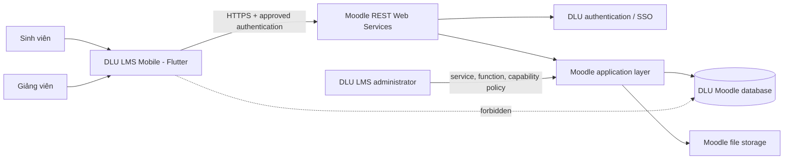
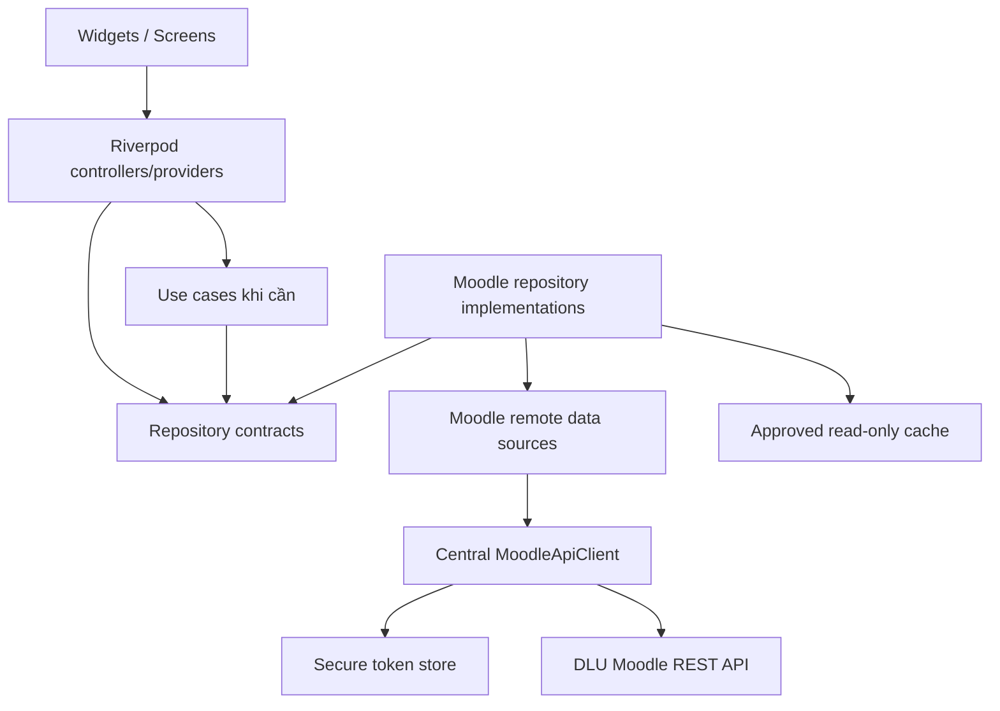
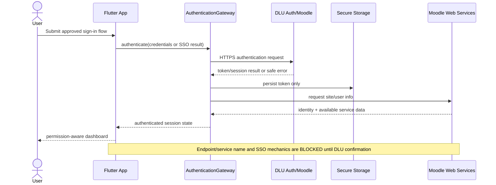
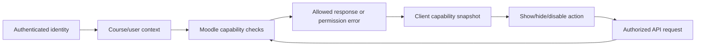
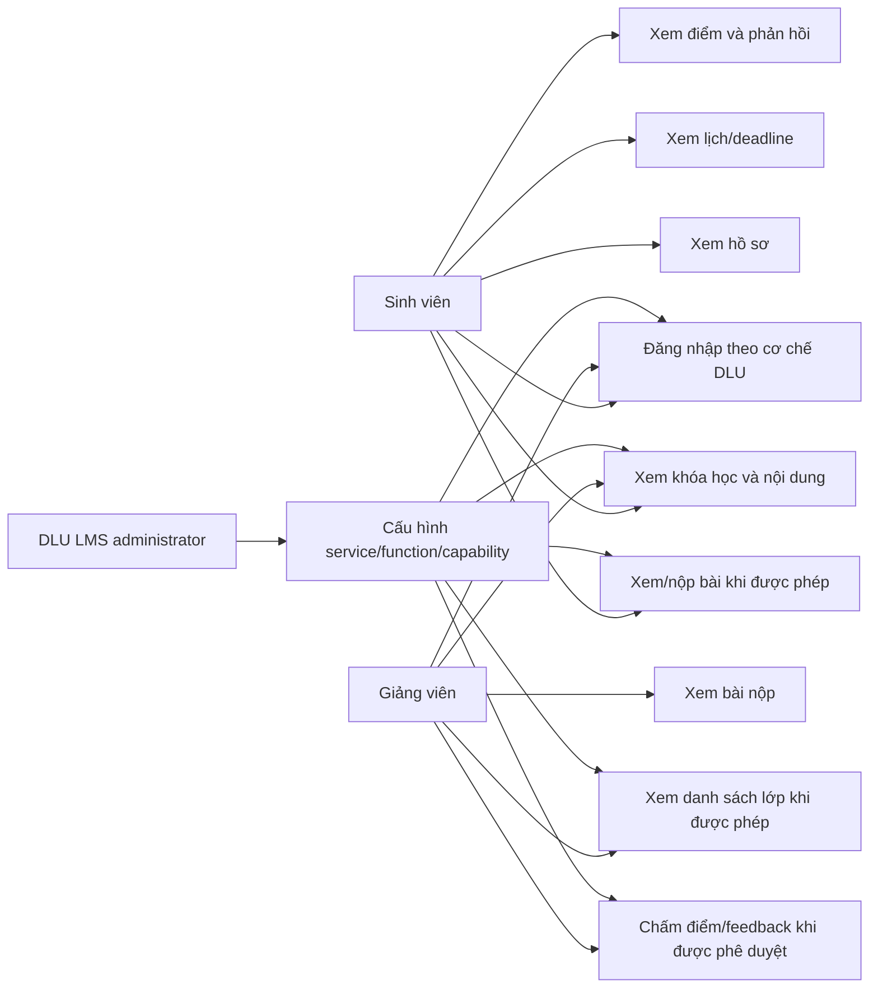
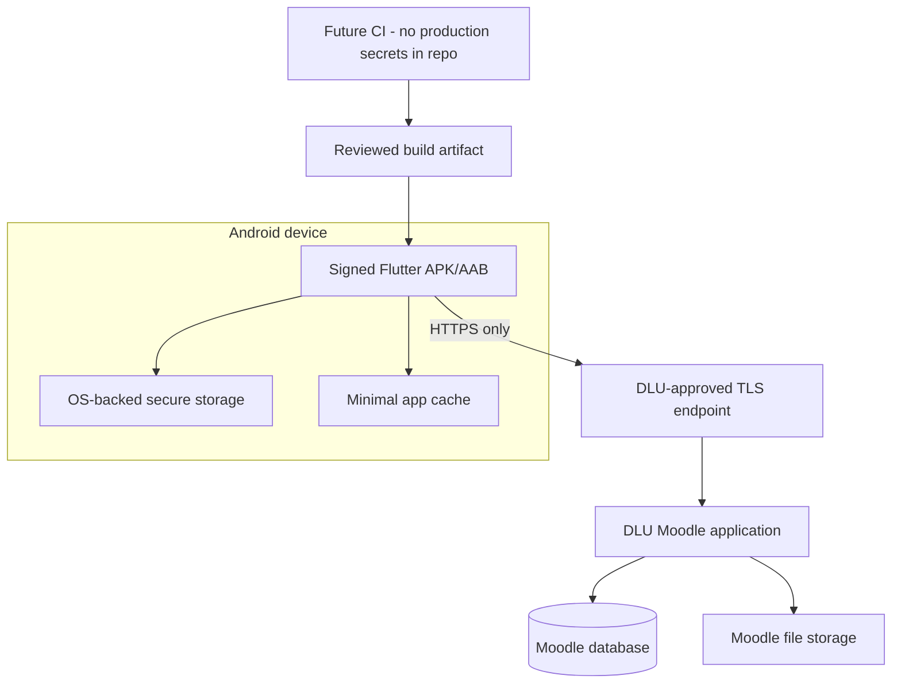

# Architecture

**Loại:** Implemented foundation + target architecture

**Implementation status:** Phase 2 foundation đã được triển khai. Các module Moodle live và phần được gắn `BLOCKED`/`PROPOSED` vẫn chưa phải chức năng production hoàn chỉnh.

**Cập nhật:** 2026-08-14

## 1. Architecture goals

Thứ tự ưu tiên quyết định: security, correctness, Moodle compatibility, maintainability, testability, UX, performance, development speed.

Thiết kế phải:

- cho phép thay đổi cơ chế authentication sau khi DLU xác nhận token login hoặc SSO;
- dùng Moodle REST Web Services và Moodle capability enforcement thay vì truy cập database trực tiếp;
- tách API DTO khỏi domain model và presentation state;
- tách mock/dev data khỏi production repository;
- giữ cấu trúc đủ rõ để sinh viên giải thích trước hội đồng, không over-engineering;
- hỗ trợ loading/empty/error/retry nhất quán;
- cho phép bổ sung local cache read-only mà không làm thay đổi source of truth về quyền.

## 2. Conditional target system context



Flutter không kết nối trực tiếp database. Database access chỉ dành cho phân tích read-only hoặc server-side work được DLU phê duyệt.

Diagram trên là target sau khi DLU enable/approve Web Services. Hiện tại `NET-TOKEN-001/002` trả `enablewsdescription`, nên runtime production vẫn dừng tại fail-closed configuration boundary; không có đường Flutter → Moodle REST đang hoạt động.

## 3. Implemented Flutter structure

```text
lib/
  app/
    app.dart
    router/
    theme/
  core/
    config/
    errors/
    network/
    storage/
    widgets/
  dev/
    fixtures/
  features/
    auth/
      domain/
      presentation/
    dashboard/
    courses/
    profile/
    splash/
  main.dart
  main_development.dart
test/
  core/
  features/
  app/
```

Hiện đã triển khai `auth`, `dashboard`, `courses`, `profile`, `splash`, core config/errors/network/storage/widgets và dev fixture boundary. Các feature chưa bắt đầu không được tạo placeholder hàng loạt.

## 4. Layer responsibilities

| Layer | Trách nhiệm | Không được làm |
|---|---|---|
| Presentation | Widget, navigation, state, loading/empty/error/retry, capability-aware controls | Parse raw JSON, lưu token, quyết định authorization cuối cùng |
| Domain | Entity/value object, repository contract, use-case logic có giá trị | Phụ thuộc Flutter widget hoặc Dio response |
| Data | Moodle DTO, mapper, remote/local data source, repository implementation | Đưa token vào log, silently fallback sang mock |
| Core | Config, HTTP client, error mapping, secure storage, common UI primitives | Chứa business logic feature-specific |
| Moodle/server | Authentication, validation, capability/context enforcement, business rules | Tin tưởng role/boolean do client gửi |

Mỗi feature không bắt buộc đủ cả ba layer nếu logic đơn giản. Tách layer theo ranh giới kiểm thử và thay đổi thực tế.

## 5. Runtime dependency direction



Dependency injection được thực hiện qua Riverpod provider. Không dùng global mutable singleton cho session/token.

## 6. Proposed packages (not installed)

| Package | Lý do | Quyết định |
|---|---|---|
| `flutter_riverpod` | State management + dependency injection có kiểu | IMPLEMENTED — 2.6.1 |
| `go_router` | Declarative navigation, auth redirect | IMPLEMENTED — 17.5.0 |
| `dio` | Timeout, request boundary và typed error mapping | IMPLEMENTED — 5.11.0 |
| `flutter_secure_storage` | Lưu token/session secret bằng platform-backed storage | IMPLEMENTED abstraction — 10.3.1; live auth chưa dùng |
| `json_annotation` + `json_serializable` | Typed DTO và predictable parsing | PROPOSED khi API contract đầu tiên rõ |
| `intl` | Date/time/localization formatting | DEFERRED — chưa có use case cần package |
| `mocktail` | Test doubles cho repository/client boundary | DEFERRED — current tests dùng fakes nhỏ |

Version chỉ được chọn khi Flutter SDK đã được cài và compatibility được kiểm tra. Không thêm package cache/database trước khi có offline use case cụ thể.

## 7. Configuration model

Compile-time/runtime configuration tối thiểu dự kiến:

- `MOODLE_BASE_URL` — mặc định development có thể trỏ DLU URL, nhưng phải validate HTTPS ở production.
- authentication strategy identifier — chỉ sau khi DLU xác nhận.
- non-secret network timeout values.
- build flavor/environment label để ngăn nhầm staging/production.

Token, username và password không nằm trong `.env` committed hoặc compile-time Dart define. `AppConfig` đọc `MOODLE_BASE_URL` qua Dart define, chỉ chấp nhận credential-free HTTPS origin (không path/query/fragment/userinfo), normalize origin và cấm DEV fixtures trong production. Token sẽ được nhận runtime và lưu qua `SecureTokenStorage` sau khi auth contract được xác nhận.

## 8. Authentication architecture

Do DLU authentication chưa được xác nhận và DLU mobile site check hiện trả `enablewsdescription`, production dùng `UnconfiguredAuthRepository` và `UnconfiguredRequestAuthorizer`, trả blocker rõ thay vì gọi endpoint phỏng đoán. Production Login không thu username/password; form credential chỉ xuất hiện trong DEV fixture. `AuthRepository` là boundary để bổ sung implementation khi có bằng chứng:

- Moodle token authentication nếu DLU cho phép;
- approved browser/SSO flow nếu DLU dùng SSO;
- không có password persistence hoặc WebView scraping fallback.

### Target authentication sequence



Token chỉ được coi là hợp lệ sau khi site/user info call thành công. Logout xóa local token/session artifacts; server-side revocation phụ thuộc capability/policy được DLU xác nhận.

## 9. Permission model

UI không dùng `isTeacher == true` để cấp toàn quyền. Một `CapabilitySnapshot` chỉ chứa bằng chứng server trả về/được suy ra từ API availability đã kiểm chứng, ví dụ quyền xem danh sách enrolled users hoặc submit/grade action trong course context.



Ẩn nút chỉ là UX; server luôn là authority cuối cùng.

## 10. Network and error architecture

`MoodleApiClient` hiện đã triển khai:

- validate/canonicalize base URL;
- HTTPS enforcement ở production;
- `RequestAuthorizer` boundary; production authorizer hiện fail closed vì chưa xác nhận auth;
- same-origin gate trước authorization và kiểm tra lại sau authorization trước network fetch;
- connect/send/receive timeout;
- Dio/HTTP failure mapping; Moodle body-level exception-envelope parsing vẫn `BLOCKED` đến khi response contract DLU được xác minh;
- cancellation qua Dio `CancelToken`.
- raw `DioException`, request options, headers, body và response không được giữ trong `AppFailure`; network diagnostic chỉ chứa method/path cùng-origin đã khử query, status và Dio type.

Correlation ID, safe retry và file download progress được giữ cho phase API thật sau khi contract tồn tại.

Error taxonomy tối thiểu:

```text
AppFailure
├── NetworkFailure
├── TimeoutFailure
├── AuthenticationFailure
├── PermissionFailure
├── MoodleApiFailure
├── ParsingFailure
├── ServerFailure
└── ConfigurationFailure
```

Không auto-retry authentication, submission, grading hoặc request WRITE.

## 11. Cache and files

- Phase đầu chỉ cân nhắc cache course metadata/recent read-only data.
- Cache không thay thế capability check, không chứa password và có clear-on-logout/user-switch.
- Dữ liệu nhạy cảm phải có classification/retention trước khi cache.
- File URL/token không được log hoặc publicize. Download đi qua endpoint/cơ chế Moodle xác nhận, có progress, cancellation và safe filename handling.

## 12. Target use cases

Sơ đồ dưới đây là scope mục tiêu, không biểu thị implementation hiện tại.



## 13. Deployment model



Release signing/CI/CD chưa được thiết kế chi tiết vì application identity, distribution policy và signing ownership chưa được cung cấp.

## 14. Architecture decisions/open decisions

| ID | Decision | Status |
|---|---|---|
| ADR-001 | Flutter/Dart, Android-first, VS Code + CLI-only Android tools | ACCEPTED |
| ADR-002 | Moodle REST through application layer; no direct DB from Flutter | ACCEPTED |
| ADR-003 | Feature-first + pragmatic clean layers | ACCEPTED/IMPLEMENTED |
| ADR-004 | Riverpod/go_router/Dio/secure storage baseline | ACCEPTED/IMPLEMENTED |
| ADR-005 | Authentication strategy selected from DLU evidence | BLOCKED — `AUTHENTICATION_METHOD_UNCONFIRMED`, `MOODLE_WEB_SERVICES_NOT_ENABLED` |
| ADR-006 | Offline persistence technology | DEFERRED until data/retention needs exist |
| ADR-007 | Custom Moodle plugin | DEFERRED/BLOCKED pending API gap + Moodle/PHP/plugin policy |
| ADR-008 | Temporary application ID `vn.edu.dlu.lmsmobile`; release signing/branding ownership | PARTIAL/BLOCKED |
| ADR-009 | Production entrypoint cannot use fixture; DEV fixture has separate entrypoint | ACCEPTED/TESTED |
| ADR-010 | Android compile SDK 36; pin secure storage 10.3.1 pending stable API 37 tooling | ACCEPTED |
