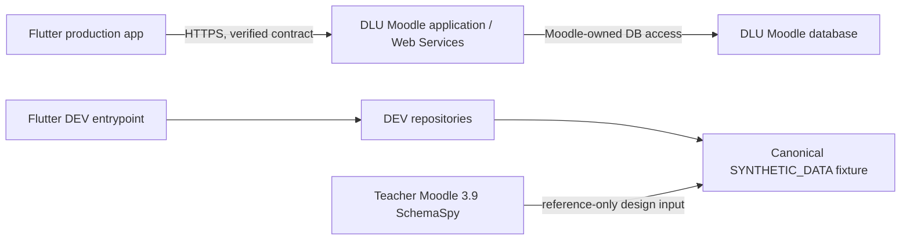

# Database Mapping

## GROUP_39_20 — current development/staging runtime

Actual candidate catalog: lms/app/derived; 35+4 physical tables; 20 derived views;
39 PK; 38 FK; 548 columns. Runtime proof and differences are recorded in
`DATABASE_MODEL_RECONCILIATION.md`. GROUP_39_20 now serves Render after the verified
candidate switch. Student adapter projects Moodle-style course/module/
assignment/grade/completion entities into the existing DTOs; unknown file metadata
stays NULL. Teacher adapter uses teacher_course_overview,
teacher_assignment_monitoring and teacher_student_monitoring behind course-context
guards. No polymorphic instance FK was invented; no table/constraint was removed.
The model and identifiers are development data, not production DLU URLs or records.

## Current baseline verification — 19/09/2026

Configured Neon catalog: lms only; 22 physical tables, 10 lms views, 22 PK,
35 physical FK, 135 physical-table columns; no app/derived schema. Counts from
`demo/01_verify_database_baseline.sql`, not inferred from Word. Group model claims
3 schemas/39 tables/20 derived views/548 columns belong to a different schema;
its schema export is missing. No migration/import was attempted. Current user
representation `lms.users` contains no password column. Role/context, enrolment,
polymorphic module and Student/Teacher view examples were exercised read-only in
`demo/02_council_database_demo.sql`; report corrections are in
`REPORT_ALIGNMENT_NOTES.md`.

**Status:** `PARTIAL — MOODLE_SUBSET_V1 GROUNDED; DLU PRODUCTION SCHEMA UNKNOWN`

**REAL_DLU_DATABASE:** `NOT_REQUIRED_FOR_CURRENT_PHASE`

**Production integration:** `MOODLE_APPLICATION_API_ONLY`
**Flutter direct database access:** `PROHIBITED`

Theo hướng dẫn hiện tại của GVHD, Phase 3 dùng schema tham chiếu tại `https://moodleschema.zoola.io/` và dữ liệu do AI tạo hoàn toàn synthetic. Vì vậy việc chưa có database thật của DLU **không còn là blocker của phase hiện tại**. Điều này không đồng nghĩa schema DLU đã được xác minh và không cho phép dùng schema tham chiếu như hợp đồng production.

## 1. Evidence classification

| Classification | Current state | May support | Must not be represented as |
|---|---|---|---|
| `TEACHER_SCHEMA_REFERENCE` | Moodle LMS 3.9 SchemaSpy snapshot, generated 2020-08-12, MySQL 5.7.31 | Chọn bảng, ghi catalog, thiết kế join path và tạo local subset | DLU Moodle version, DLU physical schema, DLU table prefix hoặc DLU API contract |
| `SYNTHETIC_DATA` | Dataset deterministic seed `202608`, không có PII/credential thật | DEV repositories, widget/unit tests, demo UI và local validation | Dữ liệu sinh viên/giảng viên/điểm/bài nộp thật của DLU |
| `DLU_LIVE_EVIDENCE` | Chưa có database/schema/API response được duyệt cho các mapping này | Chỉ được ghi nhận sau khi có bằng chứng trực tiếp, được phép | Không được suy ra từ schema tham chiếu hoặc UI web đã quan sát |

Ranh giới DLU hiện tại:

- Moodle version, database engine, table prefix, columns, indexes và physical constraints của production: `UNKNOWN`.
- Không giả định prefix `mdl_` hay bất kỳ prefix nào khác.
- Public web/UI evidence không xác minh database schema.
- Live authentication và Moodle Web Service contract vẫn chưa được xác nhận; production repositories tiếp tục fail-closed.

## 2. MOODLE_SUBSET_V1

Bộ dữ liệu phát triển được giới hạn ở 20 bảng có liên quan trực tiếp đến student demo:

- CORE: `user`, `course`, `enrol`, `user_enrolments`, `course_sections`, `modules`, `course_modules`, `resource`, `assign`, `assign_submission`, `assign_grades`, `grade_items`, `grade_grades`.
- SUPPORTING: `course_categories`, `files`, `context`, `role`, `role_assignments`, `course_modules_completion`, `event`.

Selection này là mô hình giảm gọn để sinh fixture và trace feature; không phải bản sao đầy đủ của Moodle và không phải migration nhắm vào database DLU.

## 3. App-to-schema mapping summary

| App area | Reference tables | Mapping status | Production boundary |
|---|---|---|---|
| Profile/identity | `user`; presentation context via `context`, `role`, `role_assignments` | `TEACHER_SCHEMA_REFERENCE` + `SYNTHETIC_DATA` mapping | Login/profile phải đến từ Moodle application/API được DLU duyệt; không đọc `user` trực tiếp. |
| My Courses | `user_enrolments -> enrol -> course -> course_categories` | Chuỗi chính có declared reference FKs | API phải áp dụng enrolment/visibility/capability của user hiện tại. |
| Course structure | `course -> course_sections`; `course -> course_modules -> modules` | Course/module links được reference hỗ trợ; section membership có local convention | API course contents là authority; không tự query bảng từ mobile. |
| Resources/files | `course_modules`, `modules`, `resource`, `context`, `files` | Module/file paths là discriminator-based/polymorphic | Nội dung file chỉ tải qua endpoint được Moodle authorize; không mở file pool. |
| Assignments/submissions | `assign`, `assign_submission`, `assign_grades` | Assignment child FKs được reference hỗ trợ; một số user/course links chỉ implied/local | Read/write bài nộp phải qua service function và capability đã xác minh. |
| Grades | `grade_items -> grade_grades`; optional correlation to `assign` | Grade-item/user joins có declared reference FKs; activity correlation polymorphic | Moodle/API lọc visibility/privacy; client không phải authorization source. |
| Progress | `course_modules_completion -> course_modules`, `user` | Declared reference FKs cho activity completion | Local tỷ lệ completion chỉ là projection demo; production semantics theo API. |
| Dashboard/calendar | Tổng hợp các bảng trên và `event` | Course/user/activity event paths gồm implied và polymorphic relations | API phải trả projection được phép; fixture không được dùng khi API lỗi. |

Trace chi tiết theo screen/model/repository/test nằm tại [Feature–Data Traceability](FEATURE_DATA_TRACEABILITY.md).

## 4. Relationship accuracy

Không phải mọi relation hữu ích cho ứng dụng đều là declared physical FK trong schema tham chiếu:

- `course_modules.instance` được giải theo `modules.name` tới `resource.id` hoặc `assign.id`.
- `course_modules.section -> course_sections.id` được giữ nhất quán trong local fixture nhưng reference đã kiểm tra không đủ để nâng thành declared FK.
- `grade_items.iteminstance` chỉ liên hệ assignment khi discriminator (`itemmodule`, `itemtype`) phù hợp.
- `files.itemid` chỉ có nghĩa cùng `contextid`, `component` và `filearea`.
- `context.instanceid` phụ thuộc `contextlevel`.
- `event.courseid`, `event.userid` là SchemaSpy implied paths; `event.instance` phụ thuộc module/component.
- `assign.course`, `resource.course`, `assign_submission.userid` và `assign_grades.userid` không được trình bày như declared DLU FKs khi nguồn tham chiếu chỉ hỗ trợ index/implied/application relation.

Constraint bổ sung trong local `schema.sql` hoặc validator phải mang nhãn `PROJECT_SUBSET_SCHEMA`/`LOCAL_SYNTHETIC_CONVENTION`. Một validation rule hữu ích không tạo ra bằng chứng về physical schema DLU.

## 5. Runtime architecture boundary

- Production không phụ thuộc fixture và không silently fallback sang fixture.
- DEV fixture không chứa token, password, hash, session, signing key hoặc dữ liệu cá nhân thật.
- Không xây database riêng để thay Moodle, không nối Flutter trực tiếp tới Moodle DB và không bypass Moodle capability checks.
- Nếu sau này dùng một backend app-owned (ví dụ Supabase), nó phải là boundary riêng, có ownership/RLS rõ ràng và không được mạo danh Moodle production schema hoặc trở thành đường vòng vào Moodle DB.

## 6. Current artifacts and detailed evidence

- [Schema Sources](database/SCHEMA_SOURCES.md): URL, snapshot/version và classification nguồn.
- [Feature-to-Table Matrix](database/FEATURE_TABLE_MATRIX.md): lý do feature cần từng bảng.
- [Selected Tables](database/SELECTED_TABLES.md): quyết định 13 CORE + 7 SUPPORTING và exclusions.
- [Table Catalog](database/TABLE_CATALOG.md): columns/types/defaults/indexes và relationship labels đã kiểm chứng.
- [Join Paths](database/JOIN_PATHS.md): declared, implied, polymorphic và unresolved paths.
- [ERD Core](database/ERD_CORE.md) và [ERD Extensions](database/ERD_EXTENSIONS.md): reduced diagrams, không phải DLU physical ERD.
- [CRUD Matrix](database/CRUD_MATRIX.md): app operation boundary; production client không có raw-table CRUD.
- [Synthetic Data Policy](database/SYNTHETIC_DATA_POLICY.md): fixed seed, privacy và regeneration rules.
- `database/fixtures/dlu_lms_fixture.json`: canonical development fixture, bắt buộc có marker `SYNTHETIC_DATA`.
- `database/moodle_subset/schema.sql` và `seed.sql`: local analysis/demo artifacts khi được generate; không chạy trên DLU.

## 7. Read-only DLU verification, if later authorized

Database access không cần cho phase hiện tại. Nếu DLU sau này cung cấp schema artifact hoặc read-only metadata access cho mục tiêu đối chiếu cụ thể:

1. Xác minh nguồn, quyền xử lý, sensitivity, retention và phạm vi trước khi đọc.
2. Chỉ dùng schema-only/sanitized artifact hoặc metadata read-only; không chạy migration hay write query.
3. Xác minh engine/version/prefix từ bằng chứng, không suy đoán.
4. Đối chiếu từng table/column/relation với `MOODLE_SUBSET_V1`; ghi mismatch thay vì ép schema khớp.
5. Không export PII, grades, submissions, password hashes hoặc authentication secrets.
6. Không commit dump, credentials hay query output nhạy cảm.

Chỉ khi đó mapping liên quan mới có thể nâng từ `TEACHER_SCHEMA_REFERENCE` lên `DLU_LIVE_EVIDENCE`. Việc tích hợp mobile production vẫn ưu tiên Moodle standard Web Services/application layer.

## 8. Current integration blockers

`REAL_DLU_DATABASE: NOT_REQUIRED_FOR_CURRENT_PHASE` không gỡ các gate độc lập sau:

- `MOODLE_WEB_SERVICES_NOT_ENABLED`: cần đơn vị quản trị DLU xác nhận/bật service phù hợp.
- `AUTHENTICATION_METHOD_UNCONFIRMED`: cần DLU xác nhận phương thức đăng nhập mobile được hỗ trợ.
- `MOODLE_API_TOKEN_REQUIRED`: chỉ áp dụng khi service/token flow đã được duyệt; không yêu cầu production admin password và không ghi token vào source.

Cho đến khi các gate API/auth được giải quyết bằng bằng chứng được phép, kết quả đúng của production là fail-closed; chỉ DEV entrypoint được dùng `SYNTHETIC_DATA`.
