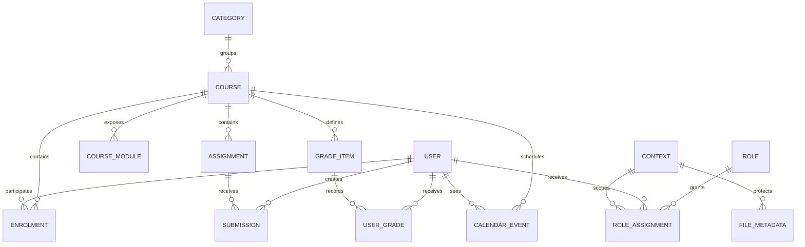

# Database Mapping

**Status:** `BLOCKED — DLU Moodle schema/database not provided`

**Access rule:** Read-only analysis first; never connect Flutter directly to the database.

## 1. Current evidence

Chưa có database dump, schema, ERD, read-only connection, Moodle version, database engine hoặc table prefix. Vì vậy:

- không có table/field nào được xác nhận;
- prefix `mdl_` không được giả định;
- danh sách `*_...` dưới đây chỉ là **candidate table families để discovery**, không phải schema DLU;
- chưa thể tạo physical ERD chính xác.

## 2. Read-only analysis workflow

Khi DLU cung cấp artifact/access được phép:

1. Xác minh artifact source, sensitivity, encryption, retention và quyền xử lý.
2. Làm việc trên bản read-only/isolated; không chạy migration hoặc destructive SQL.
3. Xác định database engine/version và Moodle table prefix từ configuration/schema evidence, không đoán.
4. Xác định Moodle version từ version metadata/source evidence nếu được cung cấp.
5. Inventory tables/columns/indexes/foreign-key-like relations; Moodle có thể không khai báo mọi FK vật lý.
6. Chỉ lấy metadata hoặc dữ liệu đã ẩn danh tối thiểu cần thiết.
7. Đối chiếu entity → table → field → API function → capability/context.
8. Cập nhật physical reduced ERD chỉ với bảng mobile app thực sự cần.
9. Xóa/hoàn trả local sensitive artifacts theo policy; không commit dump hoặc credentials.

## 3. Mapping discovery matrix

Các field cũng là candidate để tìm kiếm, không khẳng định tồn tại/ý nghĩa trên DLU.

| App feature | Conceptual Moodle entity | Candidate table family (unverified) | Candidate fields to inspect | Relationship to confirm | Candidate Moodle API | Permission/context to confirm | Status |
|---|---|---|---|---|---|---|---|
| Identity/profile | User | `*_user` | `id`, username/profile/name fields, status flags | User referenced by enrolment/role/grade/event | Site info / user functions | Own profile vs other-user visibility | BLOCKED |
| Course catalog/my courses | Course, category | `*_course`, `*_course_categories` | IDs, category, names, visibility, dates | Course belongs to category | Enrol/course functions | Enrolment and course visibility | BLOCKED |
| Enrolment | Enrol instance, user enrolment | `*_enrol`, `*_user_enrolments` | IDs, course/user links, status, time range | User enrolment links user to enrol instance/course | Enrol functions | Enrolment/context restrictions | BLOCKED |
| Roles/capabilities | Context, role assignment, role | `*_context`, `*_role_assignments`, `*_role` | IDs, context level/instance, role/user links | Role assignment applies in a context tree | No client-side DB mapping as auth source | Moodle capability system is authority | BLOCKED |
| Course content | Course modules/sections/resources | Version/plugin-dependent families | IDs, visibility, ordering, instance links | Module belongs to course/section/plugin instance | Course content functions | Module visibility/restrictions | BLOCKED |
| Assignments | Assignment | `*_assign` | IDs, course, name, due/cutoff/config fields | Assignment belongs to course | Assignment functions | Module/course context | BLOCKED |
| Submissions | Assignment submission | `*_assign_submission` | IDs, assignment/user/team, status, timestamps, attempt | Submission belongs to assignment and actor/team | Assignment submission functions | Own vs grading visibility | BLOCKED |
| Gradebook | Grade item, user grade | `*_grade_items`, `*_grade_grades` | IDs, course/item/user, grade range, final grade, feedback links | Grade item belongs to course; grade belongs to user/item | Grade report functions | Grade visibility/privacy | BLOCKED |
| Files | Stored file metadata | `*_files` | IDs, context/component/file area/item, path/name/size/hash | File belongs to Moodle context and component area | Content response/file endpoints | File context + service flags | BLOCKED |
| Calendar/deadlines | Event | `*_event` | IDs, course/user/group/module links, time/type | Event scoped to user/course/group/module | Calendar functions | Event visibility | BLOCKED |
| Notifications/messages | Message/notification subsystem | Version-dependent families | To be discovered from exact version | User/component/conversation relations | Message/notification functions | Own data and messaging capabilities | BLOCKED |

## 4. Conceptual reduced ERD

Đây là conceptual ERD để định hướng analysis, không phải physical DLU schema.

Physical relationships có thể dùng indirect/context-based links và phải được xác nhận trên schema thật.

## 5. Data dictionary template

| Verified prefix.table | Column | Type/nullability | Meaning | Classification | Relationship/index | Source evidence | Used by app/API |
|---|---|---|---|---|---|---|---|
| TBD | TBD | TBD | TBD | TBD | TBD | TBD | TBD |

Classification tối thiểu: Public, Internal, Personal, Sensitive Academic, Secret. Password hashes/auth secrets không thuộc mobile data scope.

## 6. Query safety requirements

- Chỉ metadata queries/read-only `SELECT` sau khi target được xác minh.
- Không dùng `UPDATE`, `DELETE`, `INSERT`, `ALTER`, `DROP`, `TRUNCATE`, migration hoặc stored routine trên DLU database.
- Không export toàn bộ user/grade/submission data nếu không cần.
- Không paste credential/query results chứa PII vào chat, source hoặc progress report.
- Mọi server-side production integration vẫn phải ưu tiên Moodle API/DB API, không cung cấp raw DB access cho mobile.

## 7. Exit criteria

`DLU_MOODLE_DATABASE_NOT_PROVIDED` chỉ được giải quyết khi có một trong các nguồn được duyệt:

- sanitized schema-only dump;
- anonymized representative dump;
- read-only metadata access;
- official data dictionary/ERD đủ để xác nhận mapping.

Database access không phải điều kiện bắt buộc để dùng standard Moodle APIs; chỉ thực hiện nếu có mục tiêu analysis rõ.
