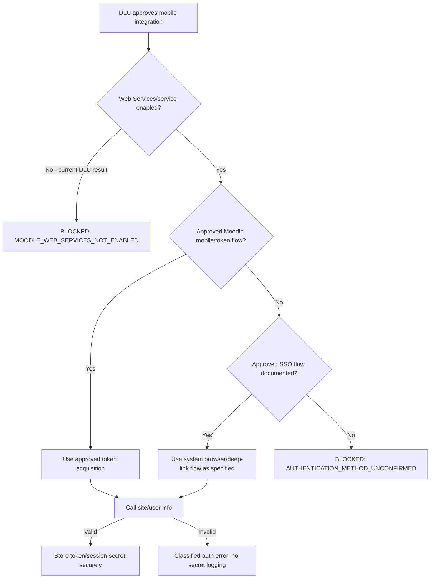

# Moodle Integration Plan

## Current boundary — 07/10/2026

Perfection hardening changes only the synthetic candidate/read-model and existing
staging app-owned support workflows; it does not discover or enable DLU Web
Services. DLU Authentication/Web Services remain **TO_VERIFY_DLU**. No browser
session/cookie extraction, production token, academic database write or guessed
activity endpoint was introduced. Production `main.dart` stays fail-closed.

Official submission/quiz/grading/administration remain LMS ONLY via the verified
exact-host HTTPS launcher. Local reminders and Teacher action/history belong to
the app, not Moodle outcomes. Candidate002/003 repairs, final code/Render181 smoke,
corrective APK and core runtime PASS; pgAdmin UI remains a human handoff
(`PERFECTION_FINAL_QA.md`), not a Moodle production verification.
The candidate owner currently bypasses RLS and has source write permission;
production requires a dedicated least-privilege database role, not merely API
guard assertions. Prior dated integration observations below are preserved.

## Current 22/09/2026 boundary

Both Student and Teacher Mobile staging repositories now consume the verified
GET-only Render GROUP_39_20 API. This is development infrastructure with synthetic
data, not Moodle Web Services. Official DLU Authentication/Web Services remain
TO_VERIFY_DLU. The exact-host HTTPS launcher opens the official LMS home only;
submission/grading remain LMS ONLY, with no fabricated activity IDs.

## Continuation evidence — 19/09/2026

Both Mobile roles can open the official HTTPS LMS through the shared safe
launcher. No activity identifiers were fabricated; no assignment or grade was
written. Existing authorized website navigation evidence is retained in
`DLU_LMS_AUTH_DISCOVERY.md`; no cookie/session/token extraction. Authentication
protocol, Web Services and Teacher capabilities remain TO_VERIFY_DLU.
Node/Fastify/Neon is development infrastructure, not DLU production truth;
the separate group schema report is reconciled in `REPORT_ALIGNMENT_NOTES.md`.

**DLU LMS:** `https://lms.dlu.edu.vn/`

**Status:** `BLOCKED_EXTERNAL — authenticated UI verified; DLU token/mobile site check reports Web Services disabled`

**Rule:** Không coi endpoint/function nào là hoạt động trên DLU cho đến khi có kiểm chứng.

## 1. Conditional production integration boundary

```text
Flutter Mobile App
  -> HTTPS
  -> Moodle REST Web Services
  -> Moodle application/capability layer
  -> DLU Moodle database and file storage
```

Không dùng Flutter-to-database. Không scrape private pages sau login và không bypass SSO/CAPTCHA/MFA.

Đây là target architecture có điều kiện, chưa phải runtime path đang hoạt động. `NET-TOKEN-001/002` cho thấy DLU hiện trả `enablewsdescription`; vì vậy production vẫn dùng unconfigured/fail-closed adapters.

## 2. Known facts vs unknowns

### Confirmed

- Public base URL `https://lms.dlu.edu.vn/` reachable over HTTPS and returns the LMS-DLU home page.
- Platform is Moodle, supported by Moodle-specific public routes, runtime/assets, cookie name and footer attribution.
- Theme candidate `lambda` is observed from public asset paths/classes; exact Moodle version remains unknown.
- Public login page exposes a username/password form and a `Google Login` option through Moodle OAuth2.
- Existing current-user browser session is authenticated and exposes Dashboard, course overview, one representative course, Profile, Calendar and own-grades navigation (`VERIFIED_UI`).
- The standard token endpoint and its read-only `appsitecheck=1` mode both returned JSON `errorcode=enablewsdescription` with no token field (`VERIFIED_NETWORK`).
- The standard REST entrypoint returned `403 text/html` to a no-parameter anonymous GET (`VERIFIED_NETWORK`); the denial layer is `UNKNOWN`.
- Production integration phải dùng dữ liệu DLU được cấp phép.
- Standard Moodle Web Services được ưu tiên hơn custom backend/plugin.

### Not confirmed

- Moodle version, PHP version, database engine/version và table prefix.
- DLU có chấp thuận bật Web Services và REST/mobile hoặc external service cho ứng dụng hay không.
- External service name/shortname và function allowlist.
- Token acquisition policy; username/password token flow có được phép hay không.
- Authentication backend behind the local form and whether Google OAuth2 is optional/required for each user group.
- Student/teacher test users, role assignments và capabilities theo context.
- File download/upload policy, token lifetime/revocation và IP restrictions.
- Staging/test LMS availability.

## 3. Discovery workflow (read-only first)

1. `DONE`: khảo sát public base site, login surface and authentication hints; evidence is under `docs/live-dlu/`.
2. `DONE`: xác minh session người dùng đã authenticated; khảo sát Dashboard/My Courses/one course/Profile/Calendar/own Grades read-only với data minimization.
3. `DONE`: thực hiện probe tối thiểu, không credential tới REST/token/mobile site-check entrypoints; ghi `MOODLE_WEB_SERVICES_NOT_ENABLED`.
4. DLU phê duyệt mobile integration và bật Web Services + selected REST/mobile/external service, ưu tiên staging/test.
5. Nhận xác nhận từ DLU về Moodle version, approved mobile auth và staging URL.
6. Nhận student test account/token theo kênh bí mật được duyệt; không lưu trong Git hoặc issue tracker.
7. Lấy live **Site administration → Server → Web services → API Documentation** export/screenshot hoặc function list do administrator cung cấp.
8. Xác nhận external service/function allowlist, file download/upload flags, token restrictions và required capabilities.
9. Thử authentication đúng flow được phê duyệt trên staging/test trước.
10. Gọi site/user information để xác nhận token/session, site identity và response contract.
11. Thực hiện read-only probes theo `API_MATRIX.md`, ghi status, sanitized sample schema và permission outcome.
12. Chỉ sau khi read flows ổn định mới lập kế hoạch WRITE probes trên test environment với explicit permission.

Moodle cung cấp live API documentation theo cấu hình/version của chính site; đó là nguồn chính xác hơn danh sách API chung.

## 4. Authentication decision tree



DLU's standard token and REST paths were reached, but the observed responses do not expose an enabled service: token/mobile site check reports `enablewsdescription`, and REST returns `403`. Không hard-code service shortname trước khi administrator xác nhận.

## 5. REST request/response handling

Sau khi contract được xác nhận, client dự kiến:

- gửi function name và response format theo Moodle REST contract của site;
- inject token ở boundary duy nhất;
- redact token/password/request fields nhạy cảm trước logging;
- parse cả HTTP failures và Moodle exception envelope;
- map invalid token/session thành `AuthenticationFailure`;
- map access/capability failure thành `PermissionFailure`;
- map malformed/changed payload thành `ParsingFailure` với safe diagnostics;
- không retry request WRITE hoặc authentication automatically.

Không lưu full production response trong fixture nếu chứa user/course/grade/file data thật. Fixtures phải synthetic hoặc được ẩn danh và duyệt.

## 6. Files

Moodle official developer documentation mô tả dedicated Web Service upload/download paths và yêu cầu service cho phép file operations. DLU-specific availability vẫn phải kiểm chứng.

Client phải:

- dùng authenticated URL/request mà DLU API trả về/cho phép;
- không ghi tokenized URL vào analytics/log/screenshot;
- sanitize filename/path, giới hạn loại/kích thước theo nghiệp vụ;
- hỗ trợ cancellation, progress và error state;
- tránh load file lớn hoàn toàn vào memory nếu endpoint hỗ trợ streaming.

## 7. Custom plugin decision gate

Chỉ lập implementation plan cho `local_dlu_mobile_api` khi tất cả điều kiện sau đúng:

1. Use case có giá trị và standard Web Services đã được kiểm chứng không đáp ứng.
2. Moodle version, PHP version, database version/engine đã biết.
3. DLU xác nhận plugin policy, review/deployment owner và test environment.
4. Capability/context model, parameter validation, output schema và audit requirements được duyệt.
5. Rollback, upgrade compatibility và automated tests được định nghĩa.

Plugin phải dùng Moodle External API/DB API, `validate_parameters`, `validate_context`, `require_capability` phù hợp và không bypass permissions. Không deploy production từ repository mobile.

## 8. Evidence record template

Mỗi live probe được ghi mà không chứa secret/PII:

```text
Date/time:
Environment: staging/test/production-read-only
Moodle version evidence:
Auth strategy:
External service (non-secret identifier):
Function:
Test persona: synthetic student/teacher
HTTP outcome:
Moodle outcome:
Capability/permission result:
Sanitized response schema:
Conclusion: PASS / FAIL / BLOCKED / PARTIAL
```

## 9. Information request for DLU/GVHD

- Moodle version and supported PHP/database versions.
- Staging/test LMS URL, nếu có.
- Authentication type/SSO documentation for third-party mobile apps.
- Approval/enablement plan for Web Services plus the selected REST/mobile/external service; current DLU probe reports disabled.
- Service shortname/token policy qua kênh an toàn.
- Sanitized list of functions enabled for that service.
- Student and teacher test accounts with representative, non-production data.
- Function/capability documentation and permission to test specific WRITE flows.
- File download/upload policy.
- Custom plugin review/deployment policy.

Không yêu cầu production admin password hoặc database/schema dump thật. Database analysis hiện dùng teacher-provided schema + synthetic data theo chỉ đạo GVHD; production mobile integration vẫn chỉ qua Moodle application/API.

## 10. Official references

- Moodle 4.5 stable token endpoint source used only to interpret `enablewsdescription`: <https://github.com/moodle/moodle/blob/MOODLE_405_STABLE/login/token.php>
- Moodle External Services: <https://moodledev.io/docs/5.0/apis/subsystems/external>
- Moodle mobile Web Services overview: <https://docs.moodle.org/502/en/Mobile_web_services>
- Moodle Web Service file handling: <https://moodledev.io/docs/5.0/apis/subsystems/external/files>

Versioned URLs ở trên là background reference chung, không phải `VERIFIED_OFFICIAL_DOC` cho DLU và không chứng minh Moodle version của DLU. Chỉ source semantics được liên kết với evidence cụ thể trong `docs/live-dlu/NETWORK_EVIDENCE.md`.
