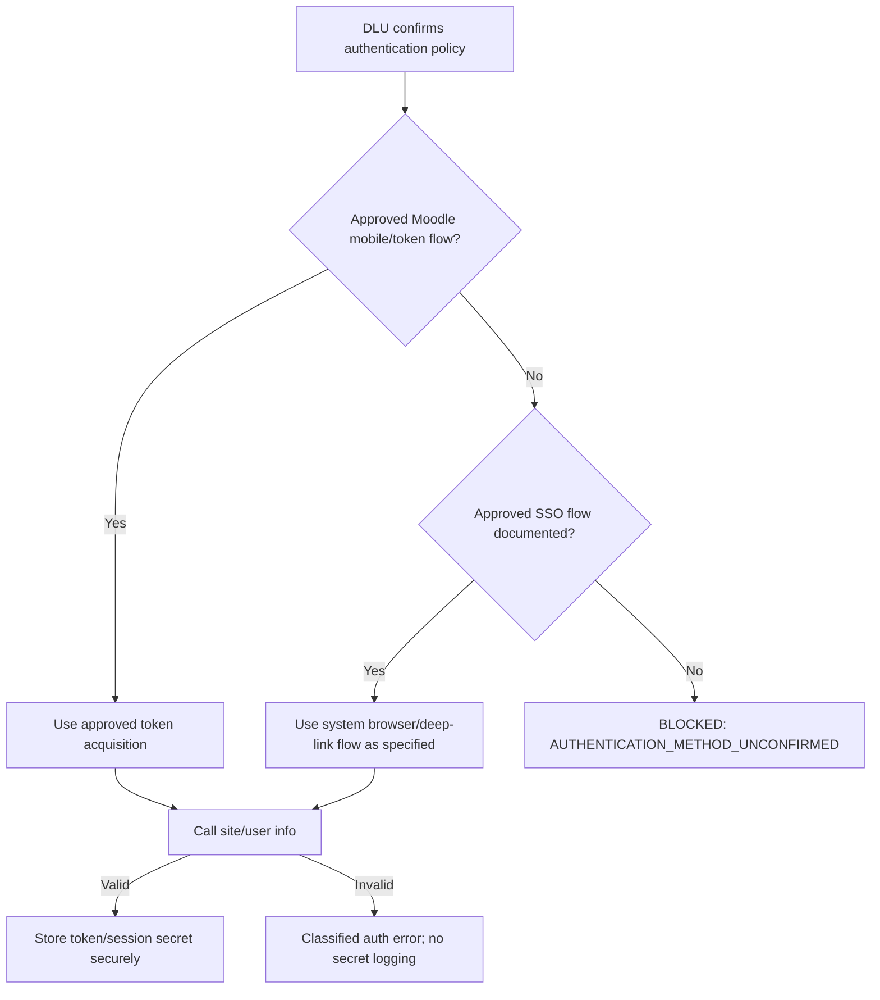

# Moodle Integration Plan

**DLU LMS:** `https://lms.dlu.edu.vn/`

**Status:** `BLOCKED — discovery evidence and authorized test access not provided`

**Rule:** Không coi endpoint/function nào là hoạt động trên DLU cho đến khi có kiểm chứng.

## 1. Production integration boundary

```text
Flutter Mobile App
  -> HTTPS
  -> Moodle REST Web Services
  -> Moodle application/capability layer
  -> DLU Moodle database and file storage
```

Không dùng Flutter-to-database. Không scrape private pages sau login và không bypass SSO/CAPTCHA/MFA.

## 2. Known facts vs unknowns

### Confirmed

- Public target base URL được người dùng cung cấp: `https://lms.dlu.edu.vn/`.
- Production integration phải dùng dữ liệu DLU được cấp phép.
- Standard Moodle Web Services được ưu tiên hơn custom backend/plugin.

### Not confirmed

- Moodle version, PHP version, database engine/version và table prefix.
- Site có bật Web Services/REST/mobile service hay không.
- External service name/shortname và function allowlist.
- Token acquisition policy; username/password token flow có được phép hay không.
- SSO/OAuth/SAML/CAS/LDAP hoặc authentication plugin đang dùng.
- Student/teacher test users, role assignments và capabilities theo context.
- File download/upload policy, token lifetime/revocation và IP restrictions.
- Staging/test LMS availability.

## 3. Discovery workflow (read-only first)

1. Nhận xác nhận từ DLU về Moodle version, auth method, staging URL và Web Services/mobile service status.
2. Nhận student/teacher test accounts hoặc token theo kênh bí mật được duyệt; không lưu trong Git hoặc issue tracker.
3. Lấy live **Site administration → Server → Web services → API Documentation** export/screenshot hoặc function list do administrator cung cấp.
4. Xác nhận external service/function allowlist, REST status, file download/upload flags, token restrictions và required capabilities.
5. Thử authentication đúng flow được phê duyệt trên staging/test trước.
6. Gọi site/user information để xác nhận token/session, site identity và response contract.
7. Thực hiện read-only probes theo `API_MATRIX.md`, ghi status, sanitized sample schema và permission outcome.
8. Chỉ sau khi read flows ổn định mới lập kế hoạch WRITE probes trên test environment với explicit permission.

Moodle cung cấp live API documentation theo cấu hình/version của chính site; đó là nguồn chính xác hơn danh sách API chung.

## 4. Authentication decision tree



Moodle installations thường có conventional Web Service paths như REST server và token login, nhưng tài liệu này không khẳng định các path/service đó được DLU bật. Không hard-code service shortname trước khi administrator xác nhận.

## 5. REST request/response handling

Sau khi contract được xác nhận, client dự kiến:

- gửi function name và response format theo Moodle REST contract của site;
- inject token ở boundary duy nhất;
- redact token/password/request fields nhạy cảm trước logging;
- parse cả HTTP failures và Moodle exception envelope;
- map invalid token/session thành `AuthenticationFailure`;
- map access/capability failure thành `PermissionFailure`;
- map malformed/changed payload thành `ParsingFailure` với safe diagnostics;
- không retry request WRITE hoặc authentication automatically.

Không lưu full production response trong fixture nếu chứa user/course/grade/file data thật. Fixtures phải synthetic hoặc được ẩn danh và duyệt.

## 6. Files

Moodle official developer documentation mô tả dedicated Web Service upload/download paths và yêu cầu service cho phép file operations. DLU-specific availability vẫn phải kiểm chứng.

Client phải:

- dùng authenticated URL/request mà DLU API trả về/cho phép;
- không ghi tokenized URL vào analytics/log/screenshot;
- sanitize filename/path, giới hạn loại/kích thước theo nghiệp vụ;
- hỗ trợ cancellation, progress và error state;
- tránh load file lớn hoàn toàn vào memory nếu endpoint hỗ trợ streaming.

## 7. Custom plugin decision gate

Chỉ lập implementation plan cho `local_dlu_mobile_api` khi tất cả điều kiện sau đúng:

1. Use case có giá trị và standard Web Services đã được kiểm chứng không đáp ứng.
2. Moodle version, PHP version, database version/engine đã biết.
3. DLU xác nhận plugin policy, review/deployment owner và test environment.
4. Capability/context model, parameter validation, output schema và audit requirements được duyệt.
5. Rollback, upgrade compatibility và automated tests được định nghĩa.

Plugin phải dùng Moodle External API/DB API, `validate_parameters`, `validate_context`, `require_capability` phù hợp và không bypass permissions. Không deploy production từ repository mobile.

## 8. Evidence record template

Mỗi live probe được ghi mà không chứa secret/PII:

```text
Date/time:
Environment: staging/test/production-read-only
Moodle version evidence:
Auth strategy:
External service (non-secret identifier):
Function:
Test persona: synthetic student/teacher
HTTP outcome:
Moodle outcome:
Capability/permission result:
Sanitized response schema:
Conclusion: PASS / FAIL / BLOCKED / PARTIAL
```

## 9. Information request for DLU/GVHD

- Moodle version and supported PHP/database versions.
- Staging/test LMS URL, nếu có.
- Authentication type/SSO documentation for third-party mobile apps.
- Web Services, REST protocol và mobile/external service status.
- Service shortname/token policy qua kênh an toàn.
- Sanitized list of functions enabled for that service.
- Student and teacher test accounts with representative, non-production data.
- Function/capability documentation and permission to test specific WRITE flows.
- File download/upload policy.
- Sanitized schema/dump or read-only database access nếu cần database analysis.
- Custom plugin review/deployment policy.

Không yêu cầu production admin password.

## 10. Official references

- Moodle External Services: <https://moodledev.io/docs/5.0/apis/subsystems/external>
- Moodle mobile Web Services overview: <https://docs.moodle.org/502/en/Mobile_web_services>
- Moodle Web Service file handling: <https://moodledev.io/docs/5.0/apis/subsystems/external/files>

Versioned URLs ở trên là reference chung, không chứng minh version DLU.
