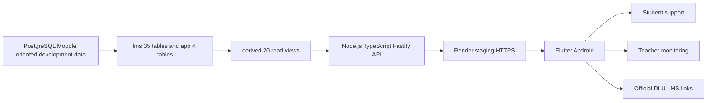
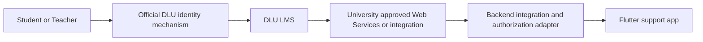

# Kiến trúc đã kiểm chứng và đích triển khai

## Development và staging hiện tại

`lms` phản ánh cấu trúc dữ liệu học tập tham chiếu Moodle, `app` giữ dữ liệu hỗ trợ thuộc Mobile, `derived` là read model. API kiểm tra hồ sơ/phạm vi ở server staging. Các header identity mẫu chỉ dùng development/staging, không phải cơ chế đăng nhập đại học. Student và Teacher API chỉ đọc; lời nhắc hiện giữ cục bộ trên thiết bị, chưa đồng bộ với `app.*` của Neon.

## Đích production cần phê duyệt

Cơ chế xác thực và Web Services DLU đang `TO_VERIFY_DLU`; sơ đồ dưới là kiến trúc mục tiêu, không phải tích hợp đã chạy. Không dùng token tự bịa, không đọc production database trực tiếp từ Flutter, không thay thế các nghiệp vụ học vụ của LMS.
