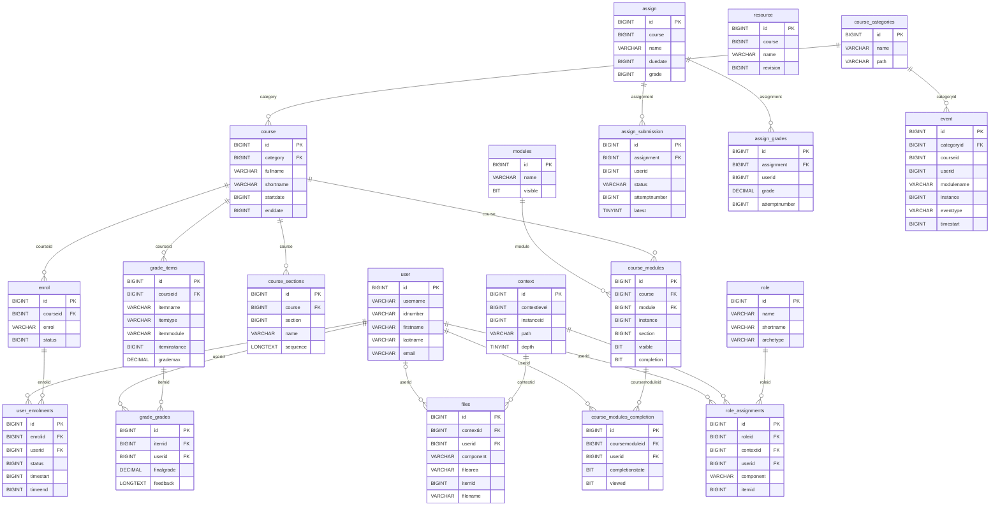

# ERD Core — MOODLE_SUBSET_V1

**Status:** `APPROVED_FOR_DEVELOPMENT`
**Tables:** 13 CORE + 7 SUPPORTING
**Evidence:** `TEACHER_SCHEMA_REFERENCE`

The diagram intentionally draws **only relationships displayed as declared foreign keys** by the selected SchemaSpy pages. Every connector below is solid for that reason. Implied, polymorphic, unresolved and local synthetic links are listed after the diagram and are not drawn as physical FKs.



## Declared-FK interpretation

| Connector group | Constraint evidence |
|---|---|
| Category/course/event | `cour_cat2_fk`, `even_cat2_fk` |
| Enrolment | `enro_cou2_fk`, `userenro_enr2_fk`, `userenro_use2_fk` |
| Course structure | `coursect_cou_fk`, `courmodu_cou2_fk`, `courmodu_mod2_fk` |
| Assignment children | `assisubm_ass3_fk`, `assigrad_ass2_fk` |
| Gradebook | `graditem_cou2_fk`, `gradgrad_ite2_fk`, `gradgrad_use3_fk` |
| Files/context | `file_con3_fk`, `file_use2_fk` |
| Contextual roles | `roleassi_rol2_fk`, `roleassi_con2_fk`, `roleassi_use2_fk` |
| Activity completion | `courmoducomp_cou2_fk`, `courmoducomp_use_fk` |

The reference includes additional audit/user FKs (for example `user_enrolments.modifierid` and `grade_grades.usermodified`) that are not needed to explain the V1 read model and are therefore omitted from the visual. Their source-table specifications remain in the teacher reference.

## Intentionally not drawn as physical FKs

| Relationship | Evidence classification | Reason |
|---|---|---|
| `course_categories.parent -> course_categories.id` | `REFERENCE_ONLY_NOT_SELECTED` | Declared in the full teacher table, but omitted from the flat V1 fixture/project projection. |
| `enrol.roleid -> role.id` | `REFERENCE_ONLY_NOT_SELECTED` | SchemaSpy labels it implied; V1 role presentation uses `role_assignments` instead. |
| `assign_submission.userid -> user.id` | `VERIFIED_SCHEMA_IMPLIED` | SchemaSpy labels it implied. |
| `assign_grades.userid -> user.id` | `VERIFIED_SCHEMA_IMPLIED` | SchemaSpy labels it implied. |
| `event.courseid -> course.id` | `VERIFIED_SCHEMA_IMPLIED` | SchemaSpy labels it implied. |
| `event.userid -> user.id` | `VERIFIED_SCHEMA_IMPLIED` | SchemaSpy labels it implied. |
| `course_modules.section -> course_sections.id` | `SCHEMA_RELATIONSHIP_UNRESOLVED` | No declared FK appears on the inspected page. |
| `course_modules.instance -> assign.id/resource.id` | `SCHEMA_RELATIONSHIP_UNRESOLVED` | Target depends on `modules.name`; this is polymorphic. |
| `assign.course -> course.id` | `SCHEMA_RELATIONSHIP_UNRESOLVED` | The page exposes an index but no declared parent FK. |
| `resource.course -> course.id` | `SCHEMA_RELATIONSHIP_UNRESOLVED` | The page exposes an index but no declared parent FK. |
| `grade_items.iteminstance -> assign.id` | `SCHEMA_RELATIONSHIP_UNRESOLVED` | Target depends on item discriminator fields. |
| `context.instanceid -> course.id/course_modules.id/...` | `SCHEMA_RELATIONSHIP_UNRESOLVED` | Target depends on `contextlevel`. |
| `files.itemid -> plugin object` | `SCHEMA_RELATIONSHIP_UNRESOLVED` | Target depends on context, component and file area. |
| `event.instance -> assign.id` | `SCHEMA_RELATIONSHIP_UNRESOLVED` | Target depends on event component/module discriminator. |

The deterministic fixture may enforce these conditional links as `LOCAL_SYNTHETIC_CONVENTION`. That does not convert them into Moodle or DLU physical FKs.

## Reading boundary

The ERD is a thesis/development model for repository and synthetic-data design. Production remains:

```text
Flutter UI -> Provider -> Repository -> approved HTTPS Moodle/backend API
```

It is never `Flutter -> Moodle database`.
