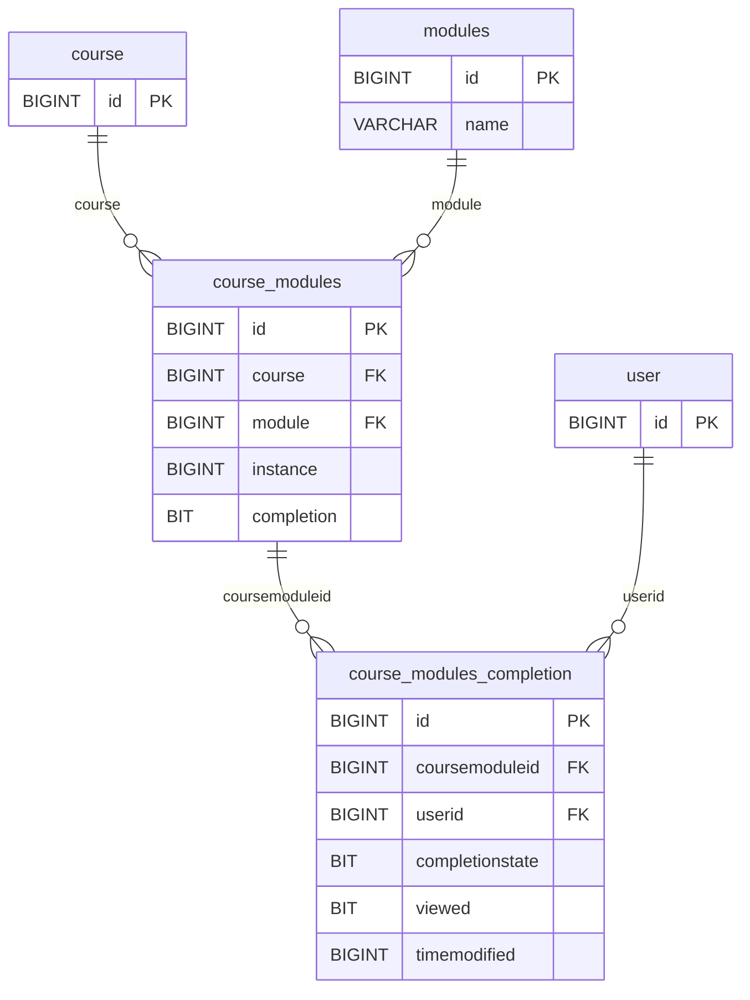
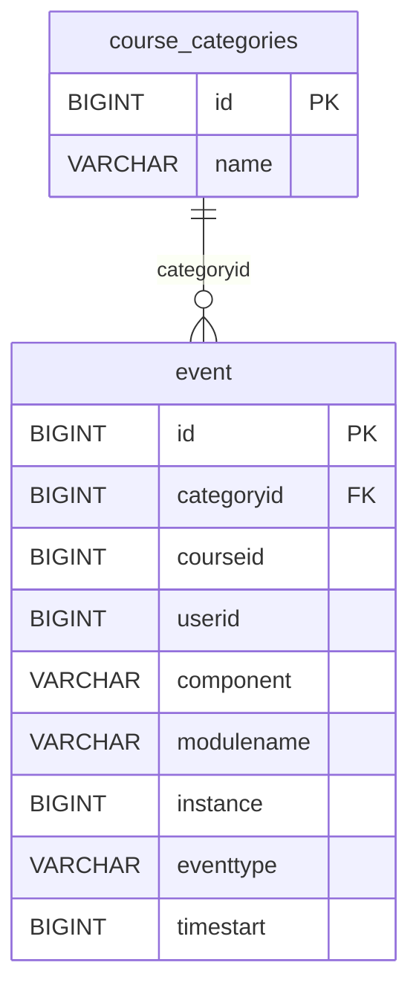

# ERD Extensions — MOODLE_SUBSET_V1

This document isolates the selected completion/calendar support from the core course, assignment and grade narrative. Solid Mermaid connectors represent only `VERIFIED_SCHEMA_FK` relationships. No implied or polymorphic relationship is drawn as a physical FK.

## Activity completion extension — selected

**V1 table:** `course_modules_completion` (`SUPPORTING`)
**Purpose:** read-only per-user activity progress

Declared evidence:

- `course_modules.course -> course.id` — `VERIFIED_SCHEMA_FK` (`courmodu_cou2_fk`).
- `course_modules.module -> modules.id` — `VERIFIED_SCHEMA_FK` (`courmodu_mod2_fk`).
- `course_modules_completion.coursemoduleid -> course_modules.id` — `VERIFIED_SCHEMA_FK` (`courmoducomp_cou2_fk`).
- `course_modules_completion.userid -> user.id` — `VERIFIED_SCHEMA_FK` (`courmoducomp_use_fk`).
- Unique `(userid, coursemoduleid)` — `courmoducomp_usecou_uix`.

V1 does **not** select `course_completions`, completion criteria or aggregation families. The current feature needs activity progress only; course-level completion would require a new feature case and subset change record.

## Calendar/upcoming extension — selected, limited scope

**V1 table:** `event` (`SUPPORTING`)
**Purpose:** read-only upcoming/deadline projection

Only `event.categoryid -> course_categories.id` is drawn because the page exposes it as a declared FK (`even_cat2_fk`). The following useful links are deliberately not drawn as physical constraints:

| Link | Classification | V1 treatment |
|---|---|---|
| `event.courseid -> course.id` | `VERIFIED_SCHEMA_IMPLIED` | Resolve and validate in synthetic data; do not call it a declared FK. |
| `event.userid -> user.id` | `VERIFIED_SCHEMA_IMPLIED` | Resolve only for the selected synthetic user projection. |
| `event.instance -> assign.id` | `SCHEMA_RELATIONSHIP_UNRESOLVED` | Interpret only when `component`/`modulename` identifies the assignment module. |
| Generated event IDs and discriminators | `LOCAL_SYNTHETIC_CONVENTION` | Validator requires every used target to exist and match its discriminator. |

V1 does not select event subscriptions, recurrence expansion or notification delivery tables. The calendar surface must remain an upcoming/read-only view until a real feature and approved API contract justify expansion.

## Optional future feature families — not selected

| Feature family | V1 status | Candidate research scope for a future version | Reason not selected now |
|---|---|---|---|
| Quiz | `OPTIONAL_FUTURE_NOT_SELECTED` | Reinspect direct teacher-reference pages for `quiz`, attempts and required question-engine tables before proposing a subset change. | No grounded quiz-taking/review feature exists in the current milestone; the question engine would materially expand the model. |
| Forum | `OPTIONAL_FUTURE_NOT_SELECTED` | Reinspect `forum`, discussion, post, subscription and read-state pages according to the exact future UX. | No current discussion feature consumes the data. |
| Notifications | `OPTIONAL_FUTURE_NOT_SELECTED` | Reinspect `notifications` and distinguish notification delivery state from the separate conversation/messaging subsystem. | Dashboard alerts do not yet have a verified API/data contract, and calendar events are not notification records. |

The candidate names above are research directions, not additions to `MOODLE_SUBSET_V1`, not a table specification, and not `DLU_LIVE_EVIDENCE`.

## Change gate for an extension

Quiz, forum, notifications or course-level completion can enter a later subset only when all are present:

1. A concrete, approved application feature and read/write boundary.
2. Direct inspection of every proposed teacher-reference table page.
3. Verified relationship/join evidence with the same FK/implied/unresolved labels.
4. A versioned subset change explaining why the current 20 tables are insufficient.
5. Updated generator, validator, repository contracts, tests, CRUD matrix, traceability and security notes.
6. Production API authorization evidence; a client-side role label or synthetic row is never sufficient.
