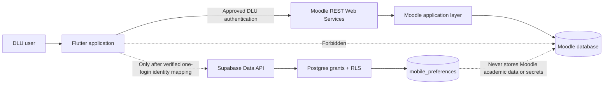

# Supabase Boundary Architecture

**Status:** Secure local foundation; not connected to a Supabase project.

**Blocker:** `SUPABASE_PROJECT_CONNECTION_REQUIRED`

## System boundary

Moodle remains authoritative for identity attributes, courses, enrolments, content, assignments, grades, submissions, roles, and capabilities. Supabase may persist only application-owned preference state after identity mapping is verified.

## Trust model

1. The Flutter client never contains a Supabase secret/service-role key, database URL/password, Moodle password, or Moodle Web Service token in source.
2. A publishable Supabase key may be supplied through reviewed runtime/build configuration only after a project is approved. A publishable key identifies the project; RLS and a valid user JWT provide authorization.
3. `auth.uid()` must resolve to the stable UUID representing the same authenticated DLU principal. The client cannot choose that identity.
4. Each operation is constrained twice: explicit Postgres grants select the allowed operation/columns; RLS selects the allowed row.
5. Anonymous sign-in is disabled in local config and anonymous authenticated JWTs are rejected in every policy.
6. Production must fail closed when Supabase configuration or the verified access token is unavailable; it must not silently use fixtures or an anonymous session.

## Database design

Only `public.mobile_preferences` exists in this foundation. Its `owner_id` UUID primary key provides one row per verified identity and indexes the RLS predicate. `theme_mode` is constrained to the three client-supported values. Audit timestamps are database-owned.

The migration deliberately:

- revokes legacy/default grants from `PUBLIC`, `anon`, `authenticated`, and `service_role`;
- grants `authenticated` only `SELECT`, `INSERT(owner_id, theme_mode)`, and `UPDATE(theme_mode)`;
- enables and forces RLS;
- creates separate own-row policies for select, insert, and update;
- provides no delete policy or privilege;
- exposes one fixed `SECURITY INVOKER` RPC that derives owner identity from `auth.uid()` and atomically saves only `theme_mode`;
- avoids views and security-definer functions;
- avoids an unverified foreign key to `auth.users`.

## Edge Function boundary

No Edge Function is implemented or deployed in this baseline. A generic Moodle proxy is explicitly forbidden.

An Edge Function may be proposed only when a verified requirement cannot safely be fulfilled by the Moodle API client or the narrow preferences Data API. Any future contract must have:

- a fixed function and operation allowlist; no user-controlled upstream URL, Moodle function name, or arbitrary HTTP method;
- verified JWT and DLU principal mapping before handling a request;
- server-side secrets only, with logs and errors redacting authorization headers, tokens, cookies, PII, grades, and submission content;
- Moodle capability/context enforcement at the authoritative backend;
- bounded timeouts, request/response size limits, rate limits, and an auditable error taxonomy;
- separate non-production verification before deployment or production write access.

Until DLU authentication and the Supabase project are connected, this boundary is contract-only and reports `SUPABASE_PROJECT_CONNECTION_REQUIRED`.

## Deployment gate

Deployment to any remote project requires an explicitly selected non-production Supabase project, approved project reference, authenticated CLI/MCP connection, and verified DLU-to-UUID identity mapping. Then, in order:

1. compare the remote Postgres major version with `supabase/config.toml`;
2. run `tool/validate_supabase_foundation.ps1`, review the migration, and apply it to the non-production branch/project;
3. execute the SQL RLS test for owner A, owner B, anonymous authenticated, and `anon` contexts;
4. run database lint/advisors and review Data API exposure/grants;
5. verify Flutter fail-closed configuration and one-login session behavior;
6. obtain approval before any production migration.

No `link`, `db push`, Edge Function deploy, or production write is authorized by this foundation milestone.
